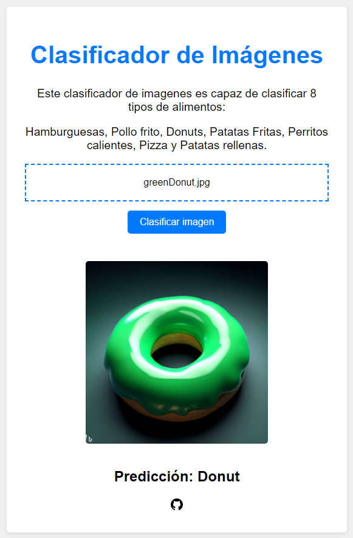

# Clasificador de Imagenes (Nuwe-Oracle)

Bienvenidos al repositorio del Clasificador de Imágenes para el concurso organizado por Nuwe y Oracle. Este proyecto tiene como objetivo desarrollar un clasificador de imágenes.

## Descripción

En el repositorio hay 2 soluciones diferentes. La primera es un clasificador básico utilizando tensorflow y keras. La segunda hace uso de la técnica de transfer learning apoyandose en el repositorio de [YOLOv8](https://github.com/ultralytics/ultralytics) de Ultralytics.

La primera solución alcanza un f1 score de aproximadamente 0.65 (se podría optimizar y desarrollar mucho más), y con la segunda hemos alcanzado un f1 score de 0.906.

Por lo tanto la versión final es la segunda, desarrollada en el notebook `yolov8_clasificacion_oracle`. Está pensado para ejecutarse en Google Colab, y para poder ejecutarlo hay que realizar los siguientes pasos:

1. Utilizando el notebook `split.ipynb` se divide el dataset en las proporciones que se deseen. En nuestro caso la mejor solucion ha sido 80% para entrenamiento y 20% para validación. La ejecución nos generará una carpeta `test` y una carpeta `data` con los datos de entrenamiento y validación respectivamente. La carpeta `data` tendrá 2 subcarpetas `train` y `val` (y test si se ha decidido utilizarlo). Dentro de estas carpetas se creará una carpeta por cada clase con las imágenes correspondientes. Una vez hehco esto, comprimir `test` y `data` en el archivo `Oracle.zip`.

2. Crear una carpeta en Google Drive llamada `oracle` y subir el archivo `Oracle.zip` a esta carpeta.

3. Ejecutar el notebook `yolov8_clasificacion_oracle` en Google Colab. En el notebook se explican los pasos a seguir para ejecutarlo.

## Resultados

La mejor puntuación obtenida ha sido de 0.906, obtenida con la segunda solución. En ella hemos utilizado 80% de los datos para entrenamiento y 20% para validación. El modelo utilizado es el `yolov8s.pt` tras 150 epochs de entrenamiento. El resto de parámetros se han dejado por defecto. Tras probar modelos más grandes (yolov8l, yolov8x...), si bien conseguían resultados similares, este ha sido el que mejor resultado ha dado, por lo que no podemos correlacionar el tamaño del modelo con el rendimiento que nos da.

Esta solución se encuentra en el fichero `predictions.json`. El modelo obtenido se puede encotrar en el fichero `results/best.pt`.

## WebUI

Se ha desarrollado una pequeña interfaz web para poder probar el clasificador. Para ejecutarla en local hay que seguir los siguientes pasos:

1. Instalar las dependencias del proyecto con `pip install -r requirements.txt` desde el directorio `WebUI`.
   ```bash
    pip install -r requirements.txt
    ```
2. Ejecutar con python el fichero `app.py`. Esto iniciará el servidor en el puerto 80.
   ```bash
    sudo python app.py
    ```

También se puede probar de forma online pinchando [aquí](http://144.24.192.35/).




## Autores

Esta solcuión ha sido desarollada por los alumnos de la UAH:

- [Jesús Palomino](https://www.linkedin.com/in/jes%C3%BAs-palomino-abreu-973667218/)
- [Eduardo Ruiz Sabajanes](https://www.linkedin.com/in/eduardo-ruiz-sabajanes-23496723a/)
- [Nicolae Alexandru Molnar](https://www.linkedin.com/in/nicolae-alexandru-molnar/)
- [Oscar Garcia Azagra](https://www.linkedin.com/in/%C3%B3scar-garc%C3%ADa-azagra-ab524b258/)
- [Sergio Gala Vilda](https://www.linkedin.com/in/sergio-gala-vilda-806914262/)
